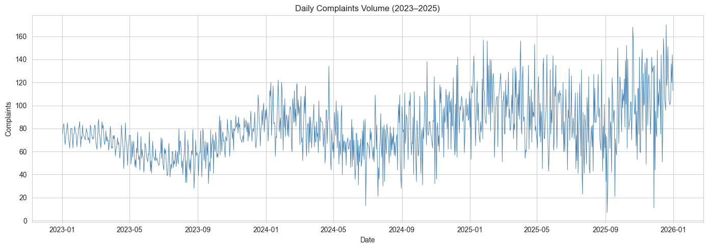
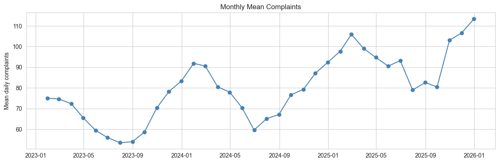
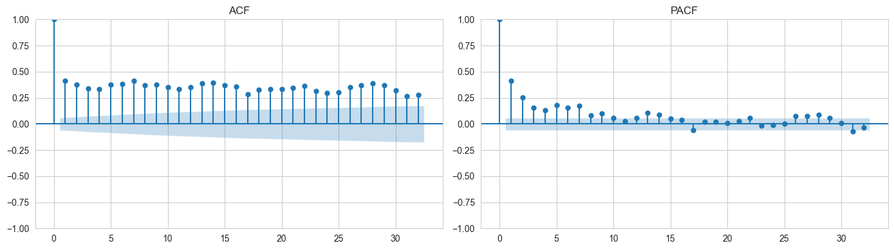
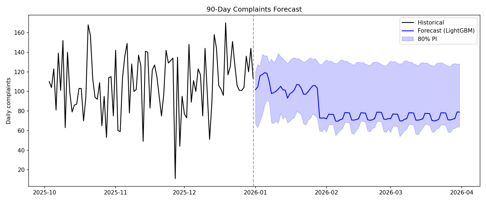
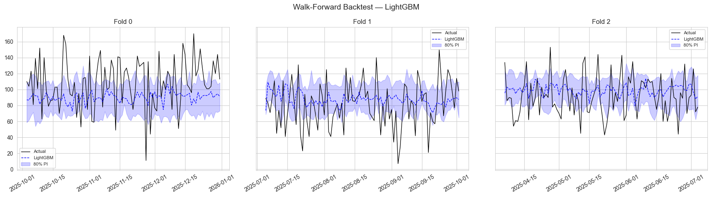
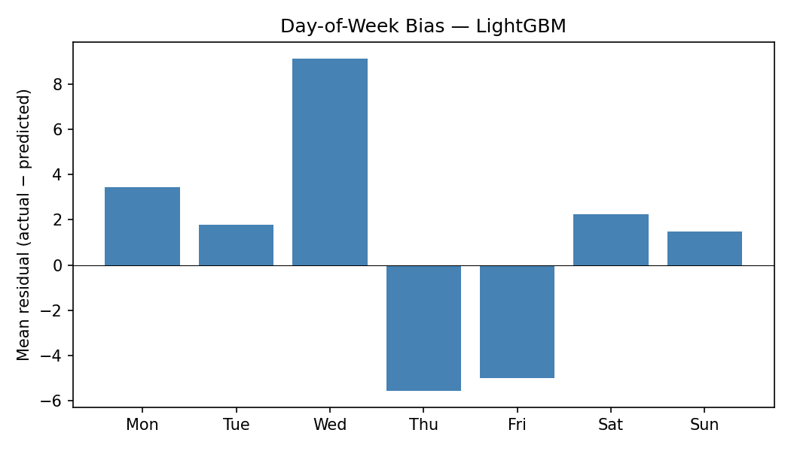

# complaints_vol_forecasting
  **Objective**: Develop a forecasting approach to predict daily complaint volume for the next 90 days after the final date in the dataset (2025-12-31 to 2026-03-31).

  ## Content
  1. Load and clean data (handle missing dates, missing values, drop leakage column)
  2. Exploratory data analysis
  3. Engineer causal features (calendar, lags, rolling stats, exogenous passthrough)
  4.  Walk-forward backtest with 3 folds × 90-day windows
  5.  Compare Seasonal Naive, SARIMAX, and LightGBM
  6.  Produce 90-day forecast with the winning model

# **Approach**
## 1. Data Loading, Cleaning & Data Quality Assessment

- **Dropping leakage**: `centered_7d_mean` is rolling mean that uses values from t−3 to t+3, making it a **leakage** feature. This means that at time t, it uses future values (t+1,t+2 and t+3), which allows the model to see "the answer". Even though this feature will work for training the model, it biases the model and will fail in production (where the future value won't be available). Hence, `centered_7d_mean` is dropped

- **Missing data patterns**:  There are 43 calendar-day gaps, 10 null target values, and nulls in exogenous columns. However, these missing values are not sufficiently concentrated to suggest systematic missingness.

- **Missing dates are filled**: the raw data has 1,053 rows over 1,096 calendar days (showing the approximately 43 gaps). These gaps will be problematic, especially if a model needs to use `lag` (the previous volume of complaints or relationship derived from it). Hence, I reindex to a full daily `DatetimeIndex` so that, for example, `lag_7` means "7 calendar days ago", not "7 rows ago".

- **Exogenous variables (staffing, backlog, media, channel_mix)- forward fill**: These are variables that are not the historical value of the target. These columns have missing values (in the range 31-74) scattered throughout the series. They are operational variables that change slowly. For example, if staffing was 35 FTE on Tuesday and Wednesday is missing, it almost certainly won't jump to 0 or 50. It stayed around 35. As a result, **Forward-fill** makes more sense than dropping the data/column (which will break the trend). **Forward-fill** encodes the assumption that yesterday's value persists until we have another value. e.g, [200, NaN, NaN, 190, NaN] becomes [200, 200, 200, 190, 190]

- **Median as fallback**: Forward-fill can't help if the first values in the series are missing. Hence, I use the median because it won't shift the distribution or introduce a trend bias, as zero or the mean of a trending series would.

- **Interpolate**: Target variable (complaints) for features, exclude from training: The EDA revealed that 53 dates have no complaint count, either the date was missing entirely (43 gap-days from reindexing) or the original value was null (10 rows). But lag features need a value at every date, otherwise "7 days ago" silently points to the wrong day. Hence, I use Linear interpolation, which is the simplest assumption for a time series. 

Note: Interpolated values are not observations. Training the model on them will teach the model to reproduce my guesses, not the real patterns. Hence, the values are used only to allow for lag/rolling features to exist for the real rows, but are never used during training.

## **EDA**: The EDA revealed.
 

- Clear upward trend: Complaint volume rises steadily over the 3-year period (2023–2025).




- Strong weekly seasonality (m=7): Weekdays have significantly higher complaints than weekends. The weekend mean is lower than the weekday mean. This justifies seasonal-naive (lag-7) as the baseline. Also, it suggests that seasonal data (e.g., DayOfWeek known as dow, month, week-of-year, etc) should be engineered 

- Bank holidays behave like weekends (lower volume), making bank_holiday_flag a valuable predictor.

- I checked how correlated the complaint volume is with its past values across different lags (past values), and the direct effect of the past lag after removing the intermediate one. I use Autocorrelation Function (ACF) and Partial Autocorrelation Function (PACF) from statsmodels 

- Significant autocorrelation at lags 1, 7, 14, 28. I used the ACF and PACF to show that the series has memory. Yesterday's value predicts today (lag-1), last week's same day predicts this week (lag-7),etc. This supports both lag features and seasonal terms, making SARIMAX the next suitable model. No enough data to determine the yearly cycle

- Exogenous correlations with complaints:
  - backlog_days: more backlog = more complaints
  - staffing_level_fte: correlation with complaints (staffing scales with volume)
  - channel_mix_index: this has a weak relationship with the target variable
  
**Low-end outlier**: Minimum complaints 7, the one percentile (P01) is 31. At least there is one anomalously low day (possibly a recording error or system outage). A model that tolerates outliers would be necessary. A tree model does. 

## **Feature engineering**:
Given that I observed seasonality, ie, repeated trend, in the data, I consider generating seasonal representative features. Hence, to enhance the chances of obtaining a good fit model, I generated 19 strictly causal features: calendar (dow, month, week-of-year, day-of-month, trend), causal lags (1, 7, 14, 28 days), trailing rolling mean/std (7d, 28d), and exogenous passthrough (staffing, backlog, media, channel mix, bank holidays).

All features used only data available at or before time t.

 **Feature Group** :Calendar
- **Columns**: dow, month, week_of_year, day_of_month, days_since_start
    - **Rationale** : Deterministically captures seasonality and trend 

 **Feature Group**: Lags: 
- **Columns**: lag_1, lag_7, lag_14, lag_28
    - **Rationale**: Recent history. lag_7 captures weekly cycle

 **Feature Group**: Rolling
- **Columns**: roll_mean_7, roll_std_7, roll_mean_28, roll_std_28 
    - **Rationale**: replaces the centered_mean as a Local level and volatility, but trailing, not centred

**Feature Group**: Exogenous variables 
- **Columns**: staffing_level_fte, backlog_days, media_mentions, channel_mix_index, bank_holiday_flag       -   Operational drivers

## **Model**: 
Based on the above EDA and the feature engineering. I chose a model from a simple to a more complex one, informed by the observations in the EDA, lags and correlation
- Base Model: The observed seasonality suggests that Seasonal Naive should be tested with m=7  
- SARIMAX performs well when there is both seasonality and exogenous variables. Hence, I choose SARIMAX(1,1,1)(1,1,0,7) with exogenous variables
- Tree models perform well with outliers. LightGBM is a lightweight and flexible learner in the tree model category. Hence, I choose LightGBM with quantile loss (q=0.1/0.9 for point forecast + 80% Prediction Interval). 

**Configuration**: 3 folds × 90-day test windows, stepping backwards from the end. Three folds (not five) because with ~1,068 usable rows, five folds would shrink the earliest training set to a point where SARIMAX becomes unstable.

 ## **Evaluation**: 
I made use of a walk-forward backtest, that is, using the past to predict the future, not a random k-fold. Random splits leak future information into training data
-Mean Average Error (MAE): This is the primary evaluation metric. It gives an easily interpretable average forecasting error in complaint units and aligns directly with operational staffing terminology.
- Root Mean Square Error (RMSE): This was used because it can easily identify large forecasting mistakes. Uses where under- or over-predictions are operationally more damaging than many small errors.
- Mean Absolute Scaled Error (MASE): Included as a scale-independent benchmark to determine whether the model performs better than a simple seasonal naive forecast.
- Pinball Loss (q=0.1, q=0.9): Used to evaluate how well the lower and upper prediction interval bounds are calibrated. I consider this useful because, operationally, a range is more useful than a single-point forecast (90 to 100 complaints).
- Coverage (80% Prediction Interval): Measures whether the prediction intervals contain the actual values at the expected frequency. It ensures forecast uncertainty is reliable for planning.

## **Result**: 
- LightGBM performed better with an average MAE of 25.1 complaints/day across folds, compared to SARIMAX with 25.9 and Seasonal Naive with 29.5. 
- Produced a 90-day forecast with 80% prediction intervals



## **Validation**:
In time-series forecasting, it is important to assess whether the model can be further improved. To do this, I used **residual Diagnostics**. This checks if there are signals or patterns in the model residue. The presence of such a signal or pattern indicates that the model can be improved or that another model provides a better fit. Operationally, this helps build stakeholders' trust in the process.

In this case, the diagnostics indicate that improvements are required. All outputs are written to Report/




### Limitations
- **MASE > 1**: The models improve on seasonal naive by test-set MAE but not by MASE (due to the in-sample denominator). With more history, the MASE denominator would stabilise.

- **PI under-coverage**: LightGBM's quantile regression PIs achieve ~45-50% coverage instead of the nominal 80%. 

- **Residual autocorrelation**: Ljung-Box test shows significant lag-7 structure in residuals. Hence, given time, I would apply a recursive multi-step approach or try a combination of models

- **Exogenous assumptions**: Future values of operational variables are held flat at recent medians. I believe that the actual values (in production) would significantly improve accuracy.

- **Only 3 years of data**: Insufficient to model yearly seasonality or long-term structural changes.

### What I will do given more time
- Conformal prediction intervals for properly calibrated PIs
- SARIMAX order selection via a broader AIC grid or auto_arima
- Ensemble of SARIMAX + LightGBM
- Recursive LightGBM variant for comparison with the direct approach


## How to Run

HINT: I used a notebook for experimenting and plotting graphs during EDA to enhance choice-making and reasoning while developing the models. However, the script runs independently of the Notebook. The entry point is clearly indicated as “Scripts/run_forecast.py”. Please follow the instructions below:
```bash

# Clone and set up

git clone https://github.com/IgweKC/complaints_vol_forecasting.git

cd complaints_vol_forecasting

python -m venv venv

# Windows:

.\venv\Scripts\activate

# macOS/Linux:

# source venv/bin/activate

pip install -r requirements.txt

# Run the full pipeline (backtest + 90-day forecast)

python scripts/run_forecast.py

```

**Outputs** are written to `reports/`:

- `forecast_90d.csv`: 90-day daily forecast with 80% prediction intervals
- `backtest_metrics.csv`: per-fold per-model evaluation metrics
- `figures/`: backtest fan chart, residual ACF, day-of-week bias, forecast plot

Step-by-step narration: `notebooks/forecast.ipynb` walks through EDA, feature engineering, backtest, and forecast with comments.

```
├── README.md
├── requirements.txt
├── .gitignore
├── data/
│   └── daily_records.csv           # source data
├── notebooks/
│   └── forecast.ipynb              # narrative end-to-end
├── src/complaints_forecast/
│   ├── __init__.py
│   ├── io.py                       # load, clean, reindex, impute, leakage drop
│   ├── features.py                 # calendar, causal lags, trailing rolling stats
│   ├── splits.py                   # rolling-origin walk-forward splitter
│   ├── metrics.py                  # MAE, RMSE, MASE, pinball, coverage
│   ├── models.py                   # SeasonalNaive, SARIMAX, LightGBM
│   └── forecast.py                 # future frame construction, 90-day forecast
├── scripts/
│   └── run_forecast.py             # single entry point
├── reports/
    ├── forecast_90d.csv
    ├── backtest_metrics.csv
    └── figures/

```


